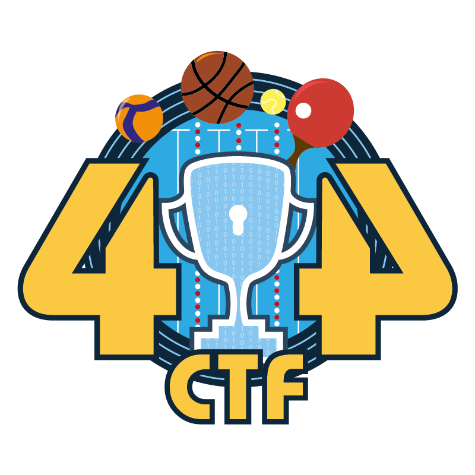

  
  <h1 style=>404 CTF - Édition 2024</h1>
  

    Ce dépôt contient les codes sources des challenges de l'édition 2024 du 404 CTF, éventuellement accompagnés de leurs solutions ou d'autres ressources complémentaires.
  

  
<i>
    This repository contains the source code for the challenges of the 2024 edition of the 404 CTF, often with their solutions or additional resources.
  </i>

  

    Éditions précédentes | <i>Previous editions</i>
     
    <a href="https://github.com/HackademINT/404CTF-2022">2022</a> | <a href="https://github.com/HackademINT/404CTF-2023">2023</a>
  

## Le 404 CTF

Le 404 CTF est la plus grande compétition de cybersécurité française. Elle est coorganisée par [la DGSE](https://www.dgse.gouv.fr), [Télécom SudParis](https://www.telecom-sudparis.eu), [HackademINT](https://www.hackademint.org), [OVHcloud](https://www.ovhcloud.com) et [Viva Technology](https://vivatechnology.com). L'édition 2024 s'est tenue du 20 avril au 12 mai 2024 et a rassemblé près de 3800 participants autours de 72 de challenges conçus par HackademINT. En savoir plus sur [le site du 404 CTF](https://www.404ctf.fr).

*The 404 CTF is France's largest cybersecurity competition. It is organized jointly by the [DGSE](https://www.dgse.gouv.fr), [Télécom SudParis](https://www.telecom-sudparis.eu), [HackademINT](https://www.hackademint.org), [OVHcloud](https://www.ovhcloud.com) and [Viva Technology](https://vivatechnology.com). The 2024 edition took place from April 20 to May 12 2024 and gathered about 3800 competitors around 72 challenges designed by HackademINT. Learn more on [the 404 CTF's website](https://www.404ctf.fr).*

## Catégories

- 🐈‍⬛ [Algorithmique quantique](AlgorithmiqueQuantique) - *Quantum computing*
- 🔐 [Cryptanalyse](Cryptanalyse) - *Cryptanalysis*
- ☎️ [Divers](Divers) - *Miscellaneous*
- ⚙️ [Exploitation de binaires](ExploitationDeBinaires) - *Binary exploitation* (Pwn)
- 🧠 Intelligence artificielle - *Artificial intelligence* (AI)
- 🔎 Investigation numérique - *Digital forensics*
- 🌎 Renseignement en sources ouvertes - *Open source intelligence* (OSINT)
- 🔧 Rétro-Ingénierie - *Reverse Engineering*
- 📟 Sécurité materielle - *Hardware*
- ❓ Stéganographie - *Steganography*
- 🌐 Web

## Licence

À l'exception des logos et des noms des partenaires et du CTF, et à moins qu'une autre licence soit explicitée dans le répertoire correspondant ou ne prévale par quelque manière que ce soit, le contenu de ce dépôt est sous [licence MIT](LICENSE).

*With the exception of the logos and names of the CTF's organizers and of the CTF itself, and unless another license is stated in the corresponding directory or takes precedence in any way, the content of this repository is provided under the [MIT license](LICENSE).*