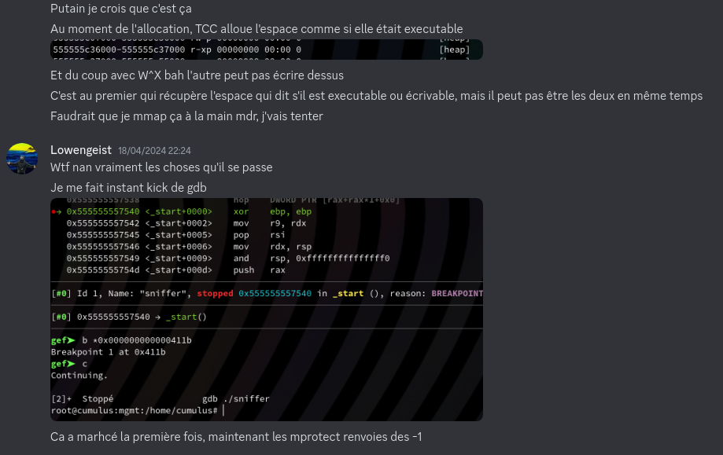
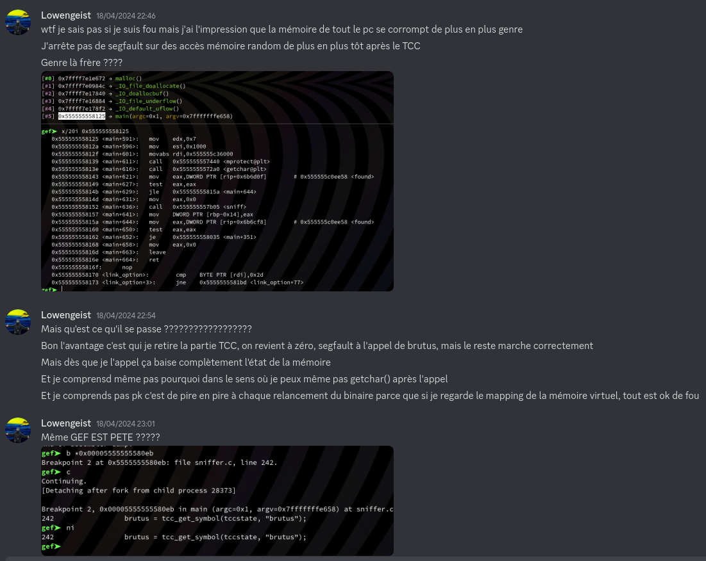

    <h1 style=>Poids Raw vs. Cours Jette</h1>
    <i>Rootkit, Cracking, Exfiltration de données</i> 

# Énoncé de la partie 2

>
<i>Cette série de challenges implique un scénario d'attaque mettant en œuvre des programmes qui peuvent potentiellement nuire à vos équipements, nous faisons appel à votre vigilance pour toute forme d'analyse dynamique</i>

>
>
>
>Ah, super ! Vous avez trouvé le programme qui semble être à l'origine de nos maux... 
>
>Il semblerait qu'une partie de son fonctionnement soit protégée par un mot de passe que nos rivaux ont mis en place...
>
>Vous pouvez peut-être retrouver ce dernier ? S'il vous plaît ? Pitié ?
>
>*** 
>

>
Ressources nécessaires :

>
Tout se trouve dans la capture mémoire, promis. 

>

>
>Auteurs : @**OwlyDuck** & @**Lowengeist**

# Solution de la partie 2

## Introduction

Pour la partie 2 (reverse engineering, donc...), l'idée était de faire du "mini-packing" en nécessitant que le client envois le bon de mot de passe afin de déchiffrer une petite routine qui rajoutait une couche de chiffrement supplémentaire pour la partie d'après. Le coeur du challenge tournait autour de fonctions trigonométriques avec l'objectif qu'elles permettent facilement de perdre le reverser et les outils de résolution d'équations automatique.

## Breakdown du programme

Je vais commenter le code source directement pour que ce soit plus direct et parce que je vois pas trop l'intérêt de faire comme si je faisais semblant de retrouver les utilisations des fonctions. Je vous encourage à aller voir les supers write-up qu'on a pu voir des participants sur le challenge pour voir l'aspect découverte et la méthodologie employée pour comprendre tout ça.  

De la ligne 69 à la ligne 105, on retrouve la définition de la plupart des fonctions qui vont nous servir pour la suite du binaire. L'idée était de recréer les fonctions trigonométriques avec des sommes issues des séries de Taylor, de considérer les charactères fournis par l'utilisateur comme des "degrées" et de les encoder par un cosinus. Je mets des guillemets à degrées parce qu'on s'est dit que le cercle trigo devait plutôt comporter 420 degrées avec ses 2pi, ça rendait moins obvious l'aspect trigonométrique de la chose et ça permettait de ramener chaque charactères plus proche de zéro et d'ainsi éviter la divergence qui va très vite avec aussi peu de bits pour nos nombres.

### Un rootkit

*A la ligne 93*, le main, on rentre dans la logique du binaire avec des trucs un peux spéicaux, des appels aux fonctions `getpid` et `kill`. La raison de l'apparition de cette logique est inscrit dans le code du rootkit. Et oui ! Voilà l'une des subtilités très importantes du challenge, la présence d'un rootkit chargé basé sur [Diamorphine](https://github.com/m0nad/Diamorphine) qui a de nombreuses fonctionnalités basé autour de hooks d'appels systèmes :
- Le hook de `kill` permet de manipuler :
	- L'envois du **signal 31** permettant désormais de **cacher un processus** en cachant son dossier nommé par son PID dans /proc, le rendant ainsi indetectable aux yeux de ps.
	- L'envois du **signal 63** permettant désormais d'**initialiser le RC4** pour une partie qui va prendre de l'importance plus tard
	- L'envois du **signal 64** permettant désormais au processus de récupérer des **privilèges root**
- Les hooks des syscalls `getdents` et `getdents64` permettent de dissimuler tous les fichiers contenant la chaîne de caractère "anssible" dans leur noms lors, par exemple, d'appels à ls
- Le hook du syscall `recvfrom`, permet que lorsqu'il est appelé par un processus caché, l'ensemble des paquets reçus soit **xoré par la clé `0xdeadbeefcafebabe`**
- Le hook du syscall `sendto`, permet que lorsqu'il est appelé par un processus caché, l'ensemble des paquets envoyés passe par une routine de **chiffrement RC4** mentionnée plus tôt

Ce qu'il se passe donc au début du binaire est simplement la création d'un processus fils ayant pour ordre d'envoyer à son père un signal le cachant.

Juste après, *à la ligne 205*, se trouve une vérification de l'intégrité du rootkit qui nous intéresse ici. Ces instructions sont là pour non seulement faire apparaître le **rootkit dans la RAM** afin qu'il puisse être dumpé, mais aussi pour gentiment leak la **localisation du .ko** :)

### Un sniffer

*De la ligne 210 à 221* on retrouve des fonctions très classiques qui préparent du networking, à savoir ouvrir un **socket UDP** en l'attente d'un preux client connaissant le mot de passe

On passe dans la fonction `search_client` qui comme son nom l'indique cherche un client éligible (connaissant donc le bon mot de passe). On a pleins de check pourris qui sont toujours vrais (`cos²+sin²=id`) juste pour embêter une potentielle execution symbolique et faire apparaître l'audio d'un rickroll dans la data (directement jouable dans Ghidra !!). Bref tout ça ne sers à rien ! Ce qui est intéressant et malheureusement raté se trouve dans la fonction check appelée à *la ligne 183*, utilisant la chaîne de caractère récupéré par notre potentiel client.

### Un crack-me non fonctionnel

**Le check**, en plus d'être assez intriqué, est **complètement pété**. Nous nous sommes rendus compte de l'erreur grâce à @Beauby... le dernier jour du CTF. La condition du check est juste tout bonnement inversé et ne sers donc plus à rien... C'est my bad et j'en suis vraiment désolé...
L'idée était que le flag avait été encodé par le passage à travers la fonction cosinus ET chiffré par le `recvfrom` hooké. On avais deux layers de chiffrement, un premier à la récéption de la donnée, et un deuxième par notre cosinus. On retrouve ainsi la donnée cruciale du flag chiffré est encodé dans la constante `flag` définie à *la ligne 40*.

### Un joli rattrapage

Le challenge était censé s'arrêter là, mais son utilité pour la suite à permis une manière alternative de solver ce dernier. En effet, on remarque que lorsqu'un client est trouvé, on a des appels à de nombreuses fonctions (strippées dans le binaire, on a linké statiquement la `libtcc`) étranges. On a pas normalement besoin de les comprendre, on peut par exemple juste retrouver la string qui va être compilée par TCC une fois le xor passé (j'ai envie de dire que c'est toujours une bonne idée de regarder l'état d'un truc après qu'il se soit fait xorer la tronche) ou comprendre ce qu'il se passe avec la fameuse strat "breakpoint avant breakpoint après" (on se rendra compte qu'il s'agit seulement d'un `x->x+10`) au niveau de l'appel à la fonction (*ligne 120*) qu'on peut croire sortie de nul part lorsque tout est strippé.

En fait, si plutôt que d'essayer de comprendre ce que fait la fonction par des manières détournée, on arrive à parfaitement saisir, avant d'avoir trouvé le bon mot de passe, qu'il est question d'appels à la `libtcc` qui va utiliser une string pour compiler un snippet de code et que l'on va ensuite récupérer le symbole associé à une fonction qui va être appelée plus tard : on peut faire une attaque par clair connu. On a déjà la connaissance de la chaîne ` brutus(` présente dans la routine chiffrée et on à aussi la connaissance du début du flag, `404CTF{` qui permet d'obtenir des information sur le début de la signature de la fonction à savoir `unsigne`, on peut donc avec du guessing sauvage, intelligent, désaprouvé, mais nécessaire à cause de mon erreur de con, retrouver le reste de la signature et assez directement retrouver le flag ainsi que la string qui va être compilée.

### Ouverture sur le troisième 

Pour la fin du binaire, l'analyse va surtout être importante dans le challenge suivant, mais on peut rapidement décrire ce qu'il se passe. On y retrouve des manipulations de librairies pas tout à fait inconnues (`libpcap` et `poll`). Le binaire va récupérer, après le mot de passe (et seulement si le mot de passe est correct en théorie) une petite chaîne qui va lui indiquer une interface sur laquelle il va devoir écouter (avec `libpcap`). On lance ensuite une capture qui va utiliser `poll` pour parallèlement envoyer les paquets à exfiltrer vers notre client authentifié et écouter sur le socket dans le cas où le client voudrait nous indiquer qu'il veut arrêter sa capture.

# Bonus

Petit bizarrerie sur laquelle je suis tombé en faisant joujou avec nos bêtises. On à fait le tour de tout le binaire, quasiment, mais il manque une petite ligne a priori insignifiante mais qui est le résultat d'un arrachage de cheveux rigolo.
*Ligne 236* : `mprotect((void*)(brutus-2240), 0x1000, PROT_READ | PROT_WRITE | PROT_EXEC);`

Lorsqu'on fait nos appels à **TCC**, ce dernier va allouer de l'espace sur la heap pour faire son affaire. Comme il fait de la compilation, il va faire en sorte que l'espace alloué soit éxecutable ! On va effectivement retrouver notre fonction assemblée dans cet epsace après éxecution de ses fonctions. 
Plus tard dans le binaire, si on cherche à allouer d'autres trucs, on va planter les trois-quarts du temps, et notamment même si on cherche à faire un `getchar()`. C'est dû au fait que lorsque **TCC** fait son affaire, il prends un gros chunk, mais genre vraiment un gros chunk. Du coup, dès qu'on va chercher à allouer d'autres trucs, il va prendre une zone adjacente qui tombe dans la zone de `0x1000` octets créé par **TCC**, qu'il ne peut pas rendre écrivable (eh ouai, `W^X`), donc du coup, j'ai été obligé de `mprotect` ça comme un gros sac en partant du principe que l'offset entre la fonction `brutus` et le début de la zone est toujours le même.

